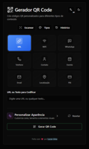
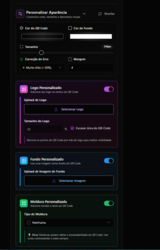
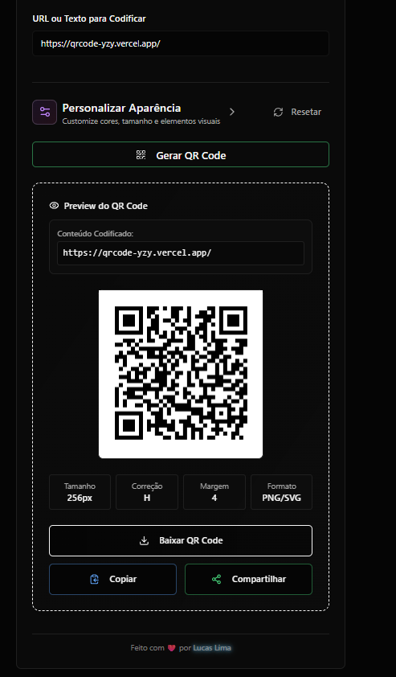

# Gerador de QR Code

Website: https://qrcode-yzy.vercel.app \
GitHub: https://github.com/opZywl/qrcode

  <h2>Screenshots</h2>
  <table>
    <tr>
      <td></td>
      <td></td>
      <td></td>
    </tr>
  </table>

## Recursos

- **16 tipos de conteúdo:** URL/texto, Wi-Fi, WhatsApp, grupo do WhatsApp, telefone, contato (vCard), evento (iCalendar), email, SMS, localização, PIX, App Store/Play Store, Spotify/YouTube, videochamada, cardápio e cupom.
- **PIX no padrão oficial do Banco Central (BR Code/EMV com CRC16)**, aceito pelos apps de banco, com detecção de CPF, CNPJ, telefone, email e chave aleatória.
- **Personalização:** cores, tamanho, nível de correção, margem, logo, imagem de fundo, molduras e templates visuais reutilizáveis.
- **Exportação** em PNG e SVG, cópia para a área de transferência e compartilhamento nativo.
- **Scanner** pela câmera ou por imagem (arrastar, colar com Ctrl+V ou selecionar), inclusive QR Codes invertidos. Links só abrem se forem http(s), mostrando o domínio antes.
- **Histórico** com busca, favoritos e tags, salvo apenas no navegador.
- Interface em **português, inglês e espanhol**, tema claro/escuro e suporte a `prefers-reduced-motion`.

## Rodando localmente

Requisitos: Node.js 22.12+ (recomendado 24 LTS) e Google Chrome.

Na raiz do projeto, no Windows:

| Comando | O que faz |
| --- | --- |
| `dev.cmd` | Confere Node/npm, instala dependências se o `package-lock.json` mudou, sobe o servidor de desenvolvimento em `http://localhost:3000`, espera o healthcheck e abre no Chrome |
| `dev.cmd prod` | Mesmo fluxo com build de produção (`next build` + `next start`) |
| `dev.cmd check` | Typecheck, lint, testes, build e `npm audit` (não abre nada) |
| `dev.cmd dev 4000` | Usa outra porta (se a porta estiver ocupada, o launcher tenta as próximas) |

Os logs do servidor ficam na janela "QR Code Studio - servidor". Para parar, feche essa janela.

## Variáveis de ambiente

Nenhuma é obrigatória. Para usar localmente, copie `.env.example` para `.env.local`.

| Variável | Para quê |
| --- | --- |
| `DISCORD_WEBHOOK_URL` | Ativa o log de QR Codes gerados em um canal do Discord. Fica só no servidor (rota `/api/qr-events`) e nunca vai para o navegador. Sem ela, o monitoramento fica desligado. |
| `NEXT_PUBLIC_SITE_URL` | URL pública usada nos metadados e na imagem de compartilhamento. Na Vercel é detectada automaticamente. |

## Privacidade e segurança

- Tudo o que é digitado, o histórico e os templates ficam no `localStorage` do navegador. Dados corrompidos ou adulterados são validados ao carregar.
- Com `DISCORD_WEBHOOK_URL` definido, cada QR gerado envia ao Discord só o tipo, as configurações visuais e um resumo mascarado (emails, telefones, chaves PIX e nomes parcialmente ocultos; a senha do Wi-Fi nunca é enviada). O horário é registrado no fuso de Brasília.
- A rota de monitoramento aceita só requisições da própria origem, valida o payload, limita a taxa por IP e bloqueia menções (`@everyone`).
- Headers de segurança em todas as respostas: CSP, `frame-ancestors 'none'`, `nosniff`, `Referrer-Policy`, `Permissions-Policy` (câmera e localização só para o próprio site) e HSTS.

## Scripts

| Script | Descrição |
| --- | --- |
| `npm run dev` | Servidor de desenvolvimento |
| `npm run build` | Build de produção |
| `npm run start` | Servidor de produção |
| `npm run lint` | ESLint |
| `npm run typecheck` | TypeScript sem emitir arquivos |
| `npm run test` | Testes (Vitest) |
| `npm run check` | Typecheck, lint e testes |

## Stack

Next.js 16 · React 19 · TypeScript 6 · Tailwind CSS 4 · Radix UI · framer-motion · qrcode.react · jsQR · Vitest

## Issues

Encontrou um bug ou sentiu falta de algo? Abra uma issue [aqui](https://github.com/opZywl/qrcode/issues).

## Contribuindo

Contribuições são bem-vindas: faça um fork, crie uma branch e abra um pull request. Antes de enviar, rode `dev.cmd check`.

## Licença

Distribuído sob os termos do arquivo [LICENSE](LICENSE).
