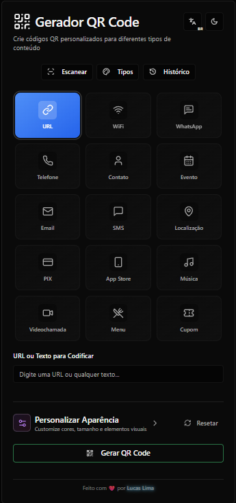
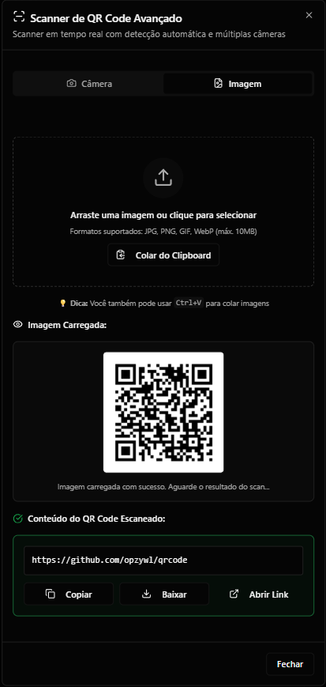
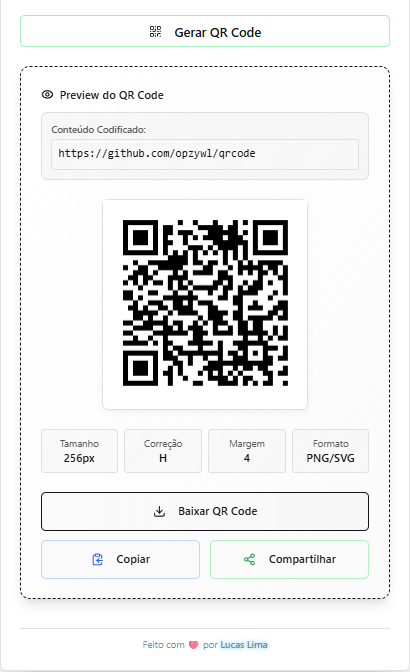

# Gerador de QR Code

Website: https://qrcode-yzy.vercel.app \
GitHub: https://github.com/opZywl/qrcode

<div align="center">
  <h2>Screenshots</h2>
  <table>
    <tr>
      <td></td>
      <td></td>
      <td></td>
    </tr>
  </table>
</div>

## Issues
Se você encontrar algum bug ou funcionalidade ausente, pode nos informar abrindo uma issue [aqui](https://github.com/opZywl/qrcode/issues).

## License
Este projeto está sujeito à [Licença MIT](LICENSE). Isso se aplica apenas ao código fonte localizado diretamente neste repositório limpo. Durante o processo de desenvolvimento e compilação, código fonte adicional pode ser usado para o qual não obtivemos direitos. Tal código não é coberto pela licença MIT.

Para aqueles que não estão familiarizados com a licença, aqui está um resumo de seus pontos principais. Isso não é de forma alguma aconselhamento jurídico nem juridicamente vinculativo.

Você tem permissão para
- usar
- compartilhar
- modificar

este projeto inteiramente ou parcialmente, gratuitamente e até comercialmente. No entanto, considere o seguinte:

- **Você deve incluir a licença e o aviso de direitos autorais em todas as cópias ou partes substanciais do software.**
- **O software é fornecido "como está", sem garantia de qualquer tipo.**

Faça o acima e compartilhe seu código fonte com todos; assim como nós fazemos.

## Tech Stack para este projeto.
- Next.js
- TypeScript
- Tailwind CSS
- shadcn/ui
- Radix UI
- React Hook Form
- Zod validation
- Lucide React Icons
- qrcode.react
- jsQR

## Compile it yourself!
O Gerador de QR Code usa Next.js e é escrito em TypeScript, então certifique-se de que esteja instalado corretamente. Instruções podem ser encontradas no [site do Node.js](https://nodejs.org/learn/get-started). Também requer NodeJS e npm.
1. Clone o repositório usando `git clone https://github.com/opZywl/qrcode`. 
2. Navegue para a pasta do seu repositório local.
3. Execute o comando `npm install && npm run build`
4. Agora você pode iniciar o gerador usando `npm run dev` ou fazer o build usando `npm run build`

## Contributing

Agradecemos as contribuições. Então, se você quiser nos apoiar, sinta-se à vontade para fazer mudanças no código fonte do Gerador de QR Code e enviar um pull request.
```
